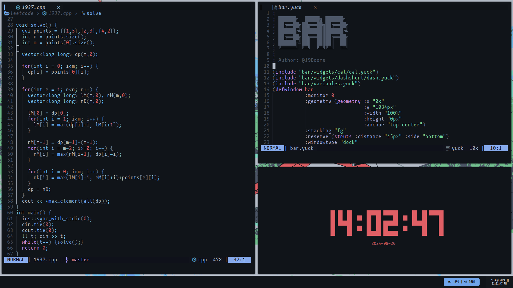

# ~Doors

## Setup

### Desktop

My display is configured for maximum efficiency, with multiple workspaces managed by the **Qtile** window manager. The setup includes:

- **Resolution**: 1920x1080
- **Custom Wallpapers**: Unique backgrounds for different workspaces for better visual organization.

### Editor 

- **Theme**: Decay 
- **Plugins**: Includes Telescope, LSPSaga, Lazy ... 
- **Custom Keybindings**: Faster Navigation and Editing 
- **Details**: 

Welcome to my Dotfiles repository! This collection contains my custom configurations for various tools and software, enabling a tailored and efficient development environment. These dotfiles are designed for Linux systems and focus on productivity, customization, and aesthetics.

## Features

- **Minimalist and efficient setup**: Focus on simplicity and speed.
- **Highly customizable**: Easy to tweak to suit your needs.
- **Integration with modern tools**: Configurations for Neovim, qtile, Eww, and more.
- **Custom scripts and aliases**: Streamline your workflow with handy shortcuts.
- **Aesthetic design**: A visually pleasing and functional environment.
